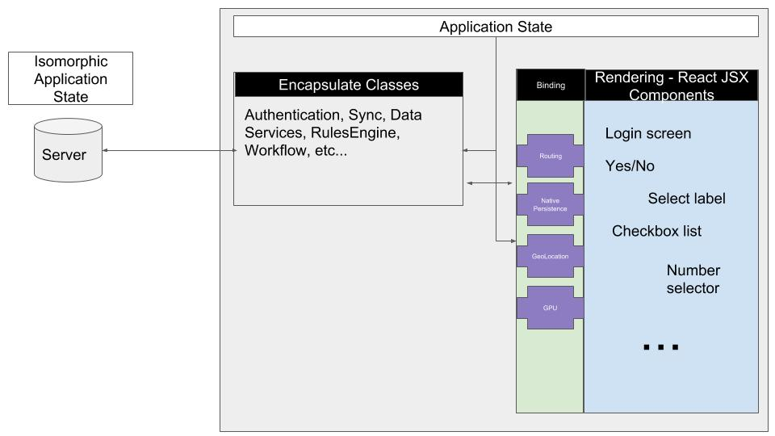
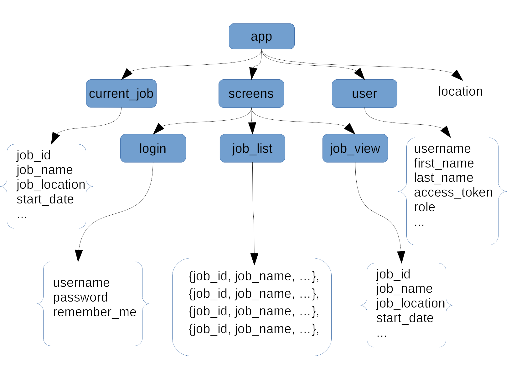

# BARE - A simplified application architecture for humans

## Introduction
Since the origins of computing, developers have struggled with the best way to structure applications. Over the years, many frameworks have evolved, some have been fairly specific to their platform/language/environment, while others have taken a more theoretical, language agnostic approach.

Many of these frameworks share several common principles, but they do it in an opinionated way. In an attempt to "be everything to everybody" these frameworks can become enormously complex.

One goal of software frameworks is generally to ease the life of the developer, and to have a consistent approach to development that can be shared across a team. One of the problems common to many frameworks is that "easy" and "simple" are properties that are subjective - developers don't all think about things the same way. An evented framework might make total sense to Jill, but be inscrutable to Bob, or vice versa.

Another goal, or possible a subset of the above goal, is to separate concerns. MVC and its many derivitave flavors are an example of this, the attempt to isolate software components between rendering concerns, data concerns and logic concerns. There have been inumerable frameworks based on this, each with their own approach based on the language and technology being used.
Separate, isolated components are a key characteristic of maintainable code. With increased interdependency between components, the risk of unintintentional side effects increases when making a change to any part of the application.

[//]: # (TODO: link to some MVC frameworks)

Recently, software architecture has moved towards "reactive" or one-way component communication. This is a great example of reducing complexity and dependencies between components. Most developers who have written software in a "two-way" databound framework can attest to the ease with which unintented effects can be triggered by simple data changes (a great example of this is Adobe Flex).

There are many implementations of reactive frameworks, and developers have been following this principle long before the term "reactive" was coined by the popular React framework. These frameworks vary in approachability, complexity and scalability.

The BARE architecture is an attempt to evaluate and distill core principles from the lessons learned over the years in framework evolution, with a primary focus on simplicity. BARE is language and technology agnostic, though for now the reference examples are written in JavaScript.

## Ok, So What Is It?

BARE is a "backronym" for the following components of a software artchitecture:

 * Binding
 * Application State
 * Rendering
 * Encapsulate

 

Each of these will be discussed in detail below, but not in order. We'll start with the most important concept, and move on from there.
It is important to note, that though there are some reference implementations like [ApplicationState](https://github.com/claytongulick/applicationstate), the BARE architecture is meant to be language and implementation agnostic.

## Application State

[ApplicationState](https://github.com/claytongulick/applicationstate), as its name implies, is the component of a central component who's only responsibility is maintaining state for an application. This state can be local, remote or isomorphic, but the key insight is that all state for any application can be represented as a directed acyclic graph (DAG). 

A very simple example of this (borrowed from the ApplicationState repo) can be seen here:

 

This component is responsible for maintaining state in the application, and for notifying the various components in the application when state has changed. Any part of the application is allowed to listen for changes at any point in the graph, if state changes anywhere below the node that is being monitored, ApplicationState *must* notify the listening component of that change. This notification *must* include the new value as well as the full path to the change (this may not be the same as the path that is being monitored). It *should* also communicate the previous state.

Application State is the central "heartbeat" of the application. It is the driver for all user interface changes, IO communication, and the application lifecycle.

An example of this is the "location" node in the above diagram. By monitoring "app.location" a stage component can trigger a transition to a different screen. This can go n-levels deep, for example, a tabbed view could have a stage component that listens to "app.screen.tabbed_view.location". The primary stage component navigates to the tabbed view via a change to "app.location" and the current displayed tab is rendered by the sub-stage component listening for changes to "app.screen.tabbed_view.location".

One advantage of representing state in this way is ease of persistence and loading. In applications where durability across restarts is necessary (mobile applications, for example) the Application State graph can be easily stored to disk and loaded after restart, triggering the relevant listeners and restoring state to the precise point where the application was terminating.

Another advantage of this sort of state graph is state *portability*. As with the simplicity of persisting the DAG to a local disk, it is trivial to persist state remotely and allow a user to restore state on a different computing device. This is a strong advantage in the modern computing world where users commonly switch between tablets, phones, laptops and desktops - there is no reason why the user experience across these devices should be anything other than seamless. A user should be able to do work on their phone while riding a bus, for example, and pick up from exactly where they left off when they get to their desk at work or home.

Additionally, local Application State can be viewed isomorphically as nothing more than a branch of a much larger state graph that encompases all users and application tasks. State can be selectively shared across subsets of users and applications.

### Application State is not data!

Conceptually, the information stored in Application State should be thought of as the current running state of an application "frozen" in time. It is not intended to store, for example, relational data, or to be a long term durable data store. While it's fine to have documents stored in Application State, these should be limited to the current working set of the application.

This is one of the lessons Google learned with Firebase and the serverless architecture, in an attempt to have a graph represent both state and data, they ran into problems with scalability, performance and analytics. Application State is *not* intended to be a replacements for an RDBMS or a document store.

## Encapsulate

An encapsulate is an *isolated* component that has no dependencies other than other encapsulate components. In general, encapulate components (as their name implies) are completely encapsulated pieces of discrete logic with well defined inputs and outputs. There are some conceivable examples where it would be appropriate for an encapsulate to monitor application state, but this shouldn't be a primary function and should be the exception. In general, monitoring Application State should be left to components in Binding or Rendering (discussed later).

Encapsulates are intended to be components that implement specific logic or rules that are applicable regardless of the rendering technology. A concrete example of this is building an appliction in JavaScript that targets Web Components/polymer, React Native, and Windows Desktop. JavaScript is a shared language between these platforms, so as much core functionality as possible should be architected into encapsulate components so that the only differences in code base are those in Binding and Rendering. Application State itself is considered an encapsulate, since it is a completely self-contained, isolated component that performs specific functionality without any external dependencies. 

In the reference implementation at [ApplicationState](https://github.com/claytongulick/applicationstate) this is demonstrated by ensuring that state persistence and loading are [implemented via plugins](https://github.com/claytongulick/applicationstate-plugin-indexeddb), since the specific mechanism that is used to persist and load the state graph is platform dependent (indexeddb for browser, NativeStorage for React Native). The plugins themselves are an example of components that should be considered "Binding" components, since they bind isolated encapsulate components to concrete Rendering, or platform, components

Application State is an encapulate broken out as a separate layer of the BARE architecture due to its importance to the overall architecture.

## Rendering

Whether it is rendering to a file, a desktop/mobile screen, audio, or the DOM in a browser, any component that has a specific dependency on the platform and is responsible for outputting the results of state changes to the user, is considered a part of the "Rendering" layer. For a UI, these will be both simple components like a checkbox or text input field, and aggregate components like a login screen, or navigation menu. 

Rendering components are generally the easiest to identify because they are completely dependent on the platform. Note, a rendering component is *not* limited to just UI display. Rendering to a file, an audio device or a GPIO pin are all valid examples of the responsibilities of a rendering component.

Also, it is important to note that BARE doesn't have an opinion at all about what technology, library or framework should be used for rendering. It is completely normal, for example, to use React Native as a rendering layer for a native mobile app with a BARE architecture. W3C, it should be pointed out, has sort of [picked a winner](https://github.com/w3c/webcomponents) for components in the DOM, but whether to use vanilla Web Components, [Polymer](https://www.polymer-project.org/) (personal recommendation is to wait until v3), [React](https://reactjs.org/), [Vue](https://vuejs.org/) or something else, is completely up to the developer. In fact, one of the main ideas behind BARE is that the Rendering layer is disposable - there will be something cooler next week. Why rewrite your whole app when that happens? Instead, let's plan for it, embrace it, and keep the secret sauce isolated.

## Binding

Binding components are the "glue" between encapsulate components and rendering components. Some very simple applications will find that these components are not necessary, as such functionality can be handled directly by the rendering component. As applications grow in size, and portability between platforms becomes more of a consideration, having binding components acting as an intermediary between concrete rendering components and isolated encapsulate components becomes more desirable.

This is one of the core differences in philosophy between BARE and other frameworks/architectures. With BARE, the layers are guidelines, and the assumption is that the developer is smart enough to know when to follow and when to break the rules. Any implementation of BARE *must* take this into consideration and *must not* enforce the separation of layers. Enforced separation of layers is one of the things that causes major headaches and complications with other architectures. BARE is unopinionated, it just has some ideas about what might help you with your application architecture.

Binding components can be considered an "interface" or "api" for the platform. When porting an application to another platform that supports the same language, the task of the developer is *vastly* simplified by only needing to reimplement the specific binding components. In many cases there will be similar rendering components on the various platforms that can be used by binding components with little or no modification (checkboxes, select lists, etc...).

## Conclusion, and a personal note

This has been a (very) brief summary of an architecture that I've been successfully implementing for many years, and have found applicable to almost every application problem I've encountered.

I've purposesfully kept it pretty vague, because the concepts are somewhat fluid - i.e. trying to distill the core components of all of the best architectures I've used over the years into some sort of formalization.

I've written this to try to gather feedback on the idea and to see if there's general developer interest. If so, I'll continue to add to this repo with code examples in various languages and platforms.

Nothing in here is particularly new or novel (except, perhaps the hierarchical notifications in ApplicationState, but I'm pretty sure that's already been done too and I just haven't come across it). In fact, that's the whole idea - to isolate and simplify concepts that I've seen repeated over the years in different frameworks.

On a personal note, I have to admit that I'm generally pretty skeptical of frameworks. After you've been developing for twenty years and have seen the cost of the constant upgrade/change cycle (**cough** angular **cough**) between framework versions, it's pretty easy to see the value of implemeting code in vanilla.

I've seen companies invest millions of dollars into a specific framework, only to have a major revision come out in a year or two that's not backwards compatible, or to have the entire framework abandoned due to lack of interest.

Fortunately, in an OSS world, we can always fork and "own" the code, but there's a huge cost to that, especially when you consider how hard it is to attract talented developers.

Would you take a recruiter's call to maintain an ASP.net 1.0 Entity Framework application? An Angular 1.0 web app? Cairngorm Flex app?

In some cases, obsolescence in unavoidable - take Adobe Flex, for example. For all its flaws, Flash was the best thing going for SPAs for a long time. It doesn't really matter what framework you chose with Flex, your investment is pretty much dead at this point. Consider, though, if you'd followed the BARE architecture with a big Flex app. Well, ES6 isn't *that* different from AS3. Those isolate classes would be simple to transpile to JS. Then you're left with Binding and Rendering to reimplement, and sure, that's work, but you have a pretty clear task list - a discrete set of components to implement and a binding layer to handle communication. That's a whole lot easier than if you'd done a ton of two-way bound components using the technology-of-the-week.

Certain language look like they're going to be around a while. C++, Java, JavaScript, C# - they're all going to be around for at least the next ten years, and that's all we can really hope for as far as longevity for an application (though, horrifically, I still have 20+ year old VB code running in production!). If we use simple constructs, stick with the vanilla language and don't escape core principles we can develop software that will be flexible and maintainable far into the future.

I'd love to hear what you think, please open an issue and let's discuss!